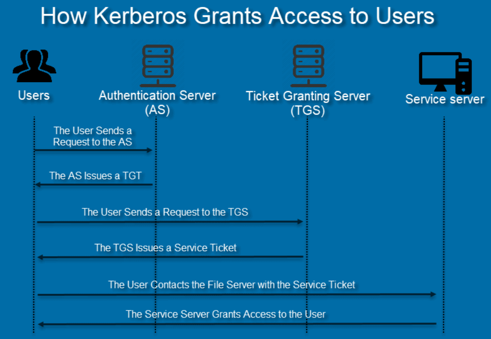

# Authentication Protocols

## Kerberos

Kerberos is a network authentication protocol. It is designed to provide strong authentication for client/server applications by using a combination of private key encryption and access tickets to safely verify user identities.

The main reasons for adopting Kerberos are:

* Plain text passwords are never sent across an insecure network.
* Encryption protects all access keys and tickets.
* Every login has three stages of authentication.
* Authentication is mutual, so both users and providers are safe from scams.

Every Kerberos verification involves a Key Distribution Center (KDC). The KDC acts as a trusted third-party authentication service, and it operates from the Kerberos server. KDC consists of three main components:
1. An authentication server (AS): The AS performs initial authentication when a user wants to access a service.
2. A ticket granting server (TGS): This server connects a user with the service server (SS).
3. A Kerberos database: This database stores IDs and passwords of verified users.

Kerberos Authentication is a multi-step process. Let us say a user wishes to access a network file server to read a document. Below are the steps required to authenticate through Kerberos:
1. The user issues an encrypted request for a Ticket Granting Ticket (TGT) to the Authentication Server. The request includes the user ID and password. When the AS gets the request, it searches for the password in the Kerberos database based on the user ID. If the user typed in the correct password, the AS decrypts the request.
2. The AS issues a TGT after verifying the user.
3. The user sends the TGT to the Ticket Granting Server. Along with the TGT, the user also explains the reason for accessing the file server. The TGS decrypts the ticket with the secret key shared with the AS.
4. If the TGT is valid, the TGS issues a service ticket to the user.
5. The user sends the service ticket to the file server. The file server decrypts the ticket with the secret key shared with TGS.
6. If the secret keys match, the file server allows the user to open the document. The service ticket determines how long the user has access to the record.

  

Once access expires, the user needs to go through the entire Kerberos authentication protocol again.

### Can Kerberos Be Hacked?

The biggest threats to a Kerberos system are forged tickets, repeated attempts to guess a password and encryption downgrading malware. A combination of all three tactics is the usual recipe for successful breaches.

The most successful methods of hacking Kerberos include:

* Pass-the-ticket: A cyber attacker forges a session key and presents the fake credentials to reach the resources. Hackers usually forge a golden ticket (a ticket that grants domain admin access) or a silver ticket (a ticket that grants access to a service).
* Credential stuffing and brute-force attacks: Automated, continued attempts to guess a user password. Most brute-force attacks go after the initial ticketing and the ticket-granting service.
* Skeleton key malware: This malware bypasses Kerberos and downgrades key encryption. The attacker must have admin access to launch the cyberattack.
* DCShadow attack: This hack occurs when attackers gain enough access within the network to set up their own DC for further infiltration.

Despite these dangers, Kerberos remains the best security protocol available today. If users practice good password choice policies, the likelihood of hacks is minimal.

## Single Sign-On (SSO)

Single Sign-on (SSO) occurs when a user logs in to one application and is then signed in to other applications automatically, regardless of the platform, technology, or domain the user is using. The user signs in only one time, hence the name of the feature (Single Sign-on). For example, if you log in to a Google service such as Gmail, you are automatically authenticated to YouTube, AdSense, Google Analytics, and other Google apps. Likewise, if you log out of your Gmail or other Google apps, you are automatically logged out of all the apps; this is known as Single Logout.

SSO provides a seamless experience for users when using applications and services. Instead of having to remember separate sets of credentials for each application or service, users can simply log in once and access your full suite of applications.

Whenever users go to a domain that requires authentication, they are redirected to the authentication domain where they may be asked to log in. If the user is already logged in at the authentication domain, they can be immediately redirected to the original domain without signing in again.

Single Sign-on and Single Logout are possible through the use of sessions. There may be up to three different sessions for a user with SSO:
1. Local session maintained by the application
2. Authorization Server session, if SSO is enabled
3. Identity Provider session, if the user chose to log in through an Identity Provider (such as Google, Facebook, or an enterprise SAML Identity Provider)

With SSO, a central domain performs authentication and then shares the session with other domains. The way a session is shared may differ between SSO protocols, but the general concept is the same.

For example, the authentication domain may generate a signed JSON Web Token (JWT) (encrypted using JSON Web Encryption (JWE)), which contains all the information needed to identify the user for any other domain requiring authentication. This token is passed to the client, but because it is signed, it cannot be modified in any way by the client. The token can be passed to the original domain by a redirect and used by the authentication domain and any other domains to identify the user.

### 1. OpenID Connect (OIDC)
OpenID Connect 1.0 is a simple identity layer on top of the OAuth 2.0 protocol. It allows third-party applications to verify the identity of the end-user and to obtain basic user profile information. OIDC uses JSON web tokens (JWTs), which you can obtain using flows conforming to the OAuth 2.0 specifications. 

While OAuth 2.0 is about resource access and sharing, OIDC is about user authentication. Its purpose is to give you one login for multiple sites. Each time you need to log in to a website using OIDC, you are redirected to your OpenID site where you log in, and then taken back to the website. For example, if you chose to sign in to Auth0 using your Google account then you used OIDC. Once you successfully authenticate with Google and authorize Auth0 to access your information, Google sends information back to Auth0 about the user and the authentication performed. This information is returned in a JWT. You'll receive an access token and if requested, an ID token.

JWTs contain claims, which are statements (such as name or email address) about an entity (typically, the user) and additional metadata. The OpenID Connect specification defines a set of standard claims. The set of standard claims include name, email, gender, birth date, and so on. However, if you want to capture information about a user and there currently isn't a standard claim that best reflects this piece of information, you can create custom claims and add them to your tokens.

With OIDC:
1. A user requests access to an application.
2. The application redirects the user to the identity provider for authentication.
3. The identity provider verifies the user, and if successful, prompts the user to grant data access to the application.
4. If access is granted, the identity provider generates an ID Token, which contains user identity information that the application can consume.
5. The identity provider returns the user to the application.

### 2. SAML (Security Authentication Markup Language) or WS-Federation

Security Assertion Markup Language (SAML) and Web Services Federation (WS-Fed) are both protocols that are widely used in SSO implementations. Both SAML and WS-Fed exchange authorization and authentication data in XML format; the main parts of this exchange are the user, the identity provider, and the service provider.
* Identity Provider - Performs authentication and passes the user's identity and authorization level to the service provider.
* Service Provider - Trusts the identity provider and authorizes the given user to access the requested resource.
  
With SAML or WS-Fed:
1. A user requests a resource from the service provider.
2. The service provider checks with the identity provider to see if the user should have access to the resource.
3. The identity provider verifies the user's identity, and if valid, asserts back to the service provider that the user should have access.

### OpenID Connect vs SAML

Choosing between OpenID Connect and SAML is not just a matter of using a newer protocol (OIDC) instead of the older more mature protocol (SAML).

SAML tends to be a bit more verbose than OIDC. 

On comparing the specifications you’ll find that OIDC was designed to work with the web while SAML was retrofitted to work on top of the web. For example, OIDC is also more suited for HTML5/JavaScript applications because it is easier to implement on the client side than SAML. As tokens are in the JSON format, they are easier to consume by JavaScript. You will also find several nice features that make implementing security in your web applications easier. For example, check out the iframe trick that the specification uses to easily determine if a user is still logged in or not.

SAML has its uses though. As you see the OIDC specifications evolve you see they implement more and more features that SAML has had for years. What we often see is that people pick SAML over OIDC because of the perception that it is more mature and also because they already have existing applications that are secured with it.