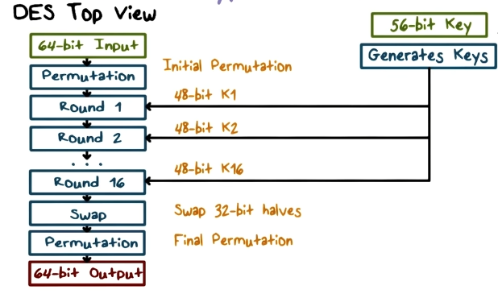
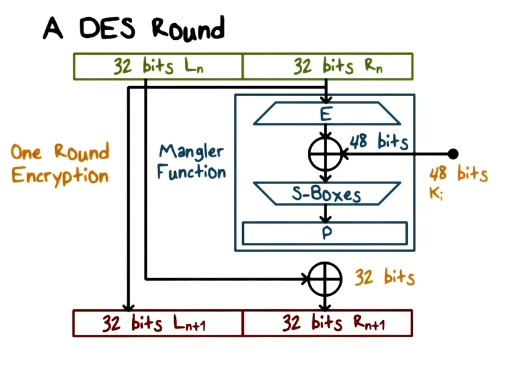
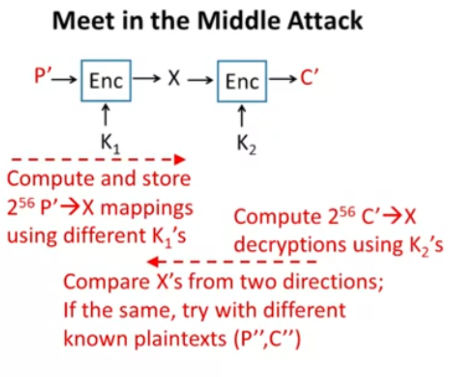

# Data Encryption Standard (DES)

The Data Encryption Standard (DES) is a symmetric-key block cipher. It is an implementation of a Feistel Cipher. It takes plain text in blocks of 64 bits and converts them to ciphertext using keys of 64 bits. Although the key size is 64 bits, 8 bits are used only for parity checking (a form of error checking). Thus, the key length is only 56 bits. 

There are 16 rounds of encryption in the algorithm, and a different key is used for each round. 

Since DES is based on the Feistel Cipher, all that is required to specify DES is −
- Round function
- Key schedule
- Any additional processing − Initial and final permutation

  

  

Each round operates on half a block (32 bits) at a time and consists of four stages:
1. Expansion: the 32-bit half-block is expanded to 48 bits using the expansion permutation, denoted E in the diagram, by duplicating half of the bits. The output consists of eight 6-bit (8 × 6 = 48 bits) pieces, each containing a copy of 4 corresponding input bits, plus a copy of the immediately adjacent bit from each of the input pieces to either side.
2. Key mixing: the result is combined with a subkey using an XOR operation. Sixteen 48-bit subkeys—one for each round—are derived from the main key using a key schedule.
3. Substitution: after mixing in the subkey, the block is divided into eight 6-bit pieces before processing by the S-boxes, or substitution boxes. Each of the eight S-boxes replaces its six input bits with four output bits according to a non-linear transformation, provided in the form of a lookup table. The S-boxes provide the core of the security of DES—without them, the cipher would be linear, and trivially breakable.
4. Permutation: finally, the 32 outputs from the S-boxes are rearranged according to a fixed permutation, the P-box. This is designed so that, after permutation, the bits from the output of each S-box in this round are spread across four different S-boxes in the next round.

DES is insecure due to the relatively short 56-bit key size. In January 1999, distributed.net and the Electronic Frontier Foundation collaborated to publicly break a DES key in 22 hours and 15 minutes. There are also some analytical results which demonstrate theoretical weaknesses in the cipher, although they are infeasible in practice. The algorithm is believed to be practically secure in the form of Triple DES, although there are theoretical attacks. This cipher has been superseded by the Advanced Encryption Standard (AES).

## Triple DES

Triple DES (3DES or TDES) is a symmetric-key block cipher, which applies the DES cipher algorithm three times to each data block. The 56-bit key in DES is no longer considered adequate in the face of modern cryptanalytic techniques and supercomputing power.

The standards define three keying options:
1. All three keys are independent. This is the strongest, with 3 × 56 = 168 independent key bits. It is still vulnerable to meet-in-the-middle attack, but the attack requires $2^{2 × 56}$ steps.
2. K1 and K2 are independent, and K3 = K1. This provides a shorter key length of 112 bits and a reasonable compromise between DES and option 1, with the same caveat as above. This is an improvement over "double DES" which only requires 256 steps to attack. 
3. All three keys are identical, i.e. K1 = K2 = K3.
This is backward compatible with DES, since two operations cancel out. NIST no longer allows the option of K1 = K2 or K2 = K3.

The encryption-decryption process is as follows −
1. Encrypt the plaintext blocks using single DES with key K1.
2. Now decrypt the output of step 1 using single DES with key K2.
3. Finally, encrypt the output of step 2 using single DES with key K3.
4. The output of step 3 is the ciphertext.
5. Decryption of a ciphertext is a reverse process. User first decrypt using K3, then encrypt with K2, and finally decrypt with K1.

The Triple DES algorithm with three independent keys (keying option 1) has a key length of 168 bits (three 56-bit DES keys), but due to the meet-in-the-middle attack, the effective security it provides is only 112 bits.\
Keying option 2 reduces the effective key size to 112 bits (because the third key is the same as the first). However, this option is susceptible to certain chosen-plaintext or known-plaintext attacks, and thus it is designated by NIST to have only 80 bits of security. This can be considered insecure, and, as consequence Triple DES has been deprecated by NIST.

### Meet in the Middle Attack

The meet-in-the-middle attack (MITM), a known plaintext attack, is a generic space–time tradeoff cryptographic attack against encryption schemes that rely on performing multiple encryption operations in sequence. The MITM attack is the primary reason why Double DES is not used and why a Triple DES key (168-bit) can be bruteforced by an attacker with 256 space and 2112 operations.

When trying to improve the security of a block cipher, a tempting idea is to encrypt the data several times using multiple keys. One might think this doubles or even n-tuples the security of the multiple-encryption scheme, depending on the number of times the data is encrypted, because an exhaustive search on all possible combination of keys (simple brute-force) would take 2n·k attempts if the data is encrypted with k-bit keys n times.

The MITM weakens the security benefits of using multiple encryptions by storing intermediate values from the encryptions or decryptions and using those to improve the time required to brute force the decryption keys. This makes a Meet-in-the-Middle attack (MITM) a generic space–time tradeoff cryptographic attack.

The MITM attack attempts to find the keys by using both the range (ciphertext) and domain (plaintext) of the composition of several functions (or block ciphers) such that the forward mapping through the first functions is the same as the backward mapping (inverse image) through the last functions, quite literally meeting in the middle of the composed function. For example, although Double DES encrypts the data with two different 56-bit keys, Double DES can be broken with 257 encryption and decryption operations.

  

The multidimensional MITM (MD-MITM) uses a combination of several simultaneous MITM attacks like described above, where the meeting happens in multiple positions in the composed function.