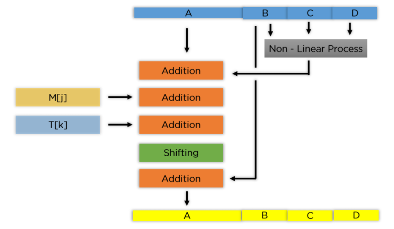

# Hashing Algorithms

While encryption is important for protecting data, it is also important to be able to prove that no one has modified the data. This can be done with hashing algorithms. A hash is a one-way function that transforms data in such a way that, given a hash result (sometimes called a digest), it is computationally infeasible to produce the original message. One-way hash functions have the following basic properties:
* They take an input of any length and produce an output of a fixed length - this means that you can use hashes on something as small as a password or as large as an entire document. The hash function would give out a hash of the same length for both. 
* They should be efficient and fast to compute.
* They should be computationally infeasible to invert.
* They should be strongly collision free. Because hash functions have a fixed output but unlimited inputs, multiple values can produce the same hash. This would not assist in verifying data integrity.
* The most important property of hash functions is the size of the hash. A larger hash makes it more difficult to invert the function, and it ensures that the function is collision free.

Another common use for a hash is for someone to demonstrate knowledge of a piece of information without actually disclosing that information. For example, to prove you know a password, you could send the actual password, or you could produce and send the hash of that password.This is useful for Web site authentication, because the server does not have to store the actual password—it needs only the hash.

Hashing algorithms are just as abundant as encryption algorithms, but there are a few that are used more often than others. Some common hashing algorithms include MD5, SHA-1, SHA-2, NTLM, and LANMAN.

## MD5

This is the fifth version of the Message Digest algorithm. MD5 creates 128-bit outputs and is typically expressed as a 32 digit hexadecimal number. It is commonly used to check the integrity of files. The algorithm is as follows - 

1. Padding Bits - When you receive the input string, you have to make sure the size is 64 bits short of a multiple of 512. When it comes to padding the bits, you must add one(1) first, followed by zeroes to round out the extra characters. 

Total length of original bits + padding bits < multiple of 512 - 64

2. Padding Length - add a few more characters to make your final string a multiple of 512. To do so, take the length of the initial input and express it in the form of 64 bits. On combining the two, the final string is ready to be hashed.

Original message + padding bits + length of input = 512 bits

3. Initialize MD Buffer - The entire string is converted into multiple blocks of 512 bits each. You also need to initialize four different buffers, namely A, B, C, and D. These buffers are 32 bits each and are initialized as follows:

A = 01 23 45 67\
B = 89 ab cd ef\
C = fe dc ba 98\
D = 76 54 32 10

4. Process Each Block - Each 512-bit block gets broken down further into 16 sub-blocks of 32 bits each. There are four rounds of operations, with each round utilizing all the sub-blocks, the buffers, and a constant array value. 

This constant array can be denoted as T[1] -> T[64].

Each of the sub-blocks are denoted as M[0] -> M[15].

  

According to the image above, you see the values being run for a single buffer A. The correct order is as follows:

- It passes B, C, and D onto a non-linear process.
- The result is added with the value present at A.
- It adds the sub-block value to the result above.
- Then, it adds the constant value for that particular iteration.
- There is a circular shift applied to the string.
- As a final step, it adds the value of B to the string and is stored in buffer A.
The steps mentioned above are run for every buffer and every sub-block. When the last block’s final buffer is complete, you will receive the MD5 digest.

The non-linear process above is different for each round of the sub-block.

Round 1: (b AND c) OR ((NOT b) AND (d))\
Round 2: (b AND d) OR (c AND (NOT d))\
Round 3: b XOR c XOR d\
Round 4: c XOR (b OR (NOT d))

### Why is MD5 not secure?
There are lots of known cryptographic weaknesses in MD5 which make it unusable as a message digest algorithm. MD5 is still a bad hashing algorithm for one simple reason: It's too fast.

In any scenario where an attacker obtained the hashed passwords, you have to assume that they also obtained the salt and pepper of each password. The only reason to use a pepper is so you can't use a rainbow table precomputed before the attack, because you need a different one for each database. The only reason to use a salt is so you can't use the same rainbow table for the whole password database, because the same password for two different accounts will have a different hash.

The length of pepper and salt don't matter that much. Their only purpose is to make sure that each value is unique. More length doesn't make the attack notably harder (there is more data to hash, but that's a linear increase at most).

Bottom line is, a short salt is all that is needed to make sure that the attacker has to brute-force all possible passwords to find the correct hash for every single account.

And that's where MD5's weakness comes into play: It's a fast and memory-conserving algorithm. That means an attacker can compute the hash of a large number of passwords per second. Using specialized hardware (like FPGA arrays or ASICs) worth a few thousand dollar you can compute the hashes of all possible 8-character passwords for a given salt in mere hours.

Additionally, it was also discovered that in some cases, change in the inputs to MD5 introduced very minor changes in the resulting hashes making it easy to break. It was also seen that MD5 was susceptible to a collision attack and a pair of inputs that generated the same hash could be found in seconds.

For better security, use a slow algorithm like bcrypt. It means that your system needs some more CPU cycles to authenticate users, but the payoff is usually worth it because an attacker will also need a whole lot more processing power to brute-force your password database should they obtain it.

## SHA-1

This is the second version of the Secure Hash Algorithm standard, SHA-0 being the first. SHA-1 creates 160-bit outputs typically rendered as 40 digit hexadecimal numbers. SHA-1 is one of the main algorithms that began to replace MD5, after vulnerabilities were found. 

The algorithmic process basically consists of taking inputs in blocks of 512 bits, and performing multiple rounds of complex compression operation to generate the final hash.

Since 2005, SHA-1 has not been considered secure against well-funded opponents; as of 2010 many organizations have recommended its replacement. NIST formally deprecated use of SHA-1 in 2011 and disallowed its use for digital signatures in 2013. As of 2020, chosen-prefix attacks against SHA-1 are practical. As such, it is recommended to remove SHA-1 from products as soon as possible and instead use SHA-2 or SHA-3. Replacing SHA-1 is urgent where it is used for digital signatures.

In February 2017, CWI Amsterdam and Google announced they had performed a collision attack against SHA-1, publishing two dissimilar PDF files which produced the same SHA-1 hash. However, SHA-1 is still secure for HMAC.

## SHA-2

SHA-2 a suite of hashing algorithms that contains SHA-224, SHA-256, SHA-384, and SHA-512. Each algorithm is represented by the length of its output. The algorithmic process basically consists of taking inputs in blocks of 512 bits, and performing multiple rounds of complex compression operation to generate the final hash. The input block size is increased to 1024 bits in the case of SHA-512, and the number of rounds is increased to 80, instead of 64. SHA-2 algorithms are more secure than SHA-1 algorithms, but SHA-2 has not gained widespread use.

## Hashing Passwords

An important use for hashes is storing passwords. Actual passwords should never be stored directly in the database. Hashes of passwords can be stored to authenticate the user. Because it is highly unlikely that two passwords would produce the same hash, you can compare the stored hash with a hash of the password submitted by the user. If the two match, you can be sure that the user has the correct password.

Protecting passwords with hashes has some unique problems. First, although hashes are not reversible, they are crackable using a brute-force method. You cannot produce the password from the hash, but you can create hashes of millions of passwords until you find one that matches. For this reason, the hash's strength isn't based so much on the key length of the hashing algorithm, but on the length of the password itself. And because passwords have such low entropy, are predictable, and are often too short, this usually is not a difficult task.

Another problem with hashes is that the same data will always produce the same hash. This can be a problem if someone ever obtains the hashes, because they can use a precomputed dictionary of hashes to instantly discover common passwords. To prevent this situation, we can add a salt to the password to ensure a different hash each time. The salt should be a large random number uniquely generated for that purpose. You do not need to keep the salt private, so you can save the salt with the hash itself.

When you use a salt, there are as many possible hashes for any given piece of data as there are bits in the salt. Of course, if the intruder has access to the hashes, they also have access to the salts, but the key here is to force the attacker to compute each hash individually and not gain any benefit from passwords he or she has already cracked. 

## Birthday Attacks

Birthday attacks are based on a unique problem with hashing algorithms based on a concept called the Birthday Paradox. This puzzle is based on the fact that in a room of 183 people, there would be a 50 percent chance of one of them sharing your birthday. However, if you wanted a 50 percent chance of finding any two people who had matching birthdays, you would surprisingly only need 23 people in the room. For hashing functions, this means that it is much easier to find any two matches if you don't care which two they are. It is possible to precompute hashes for a given password length to determine if any collisions occur.