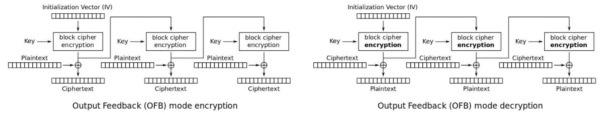

# Modes of Encryption

Stream Cipher - Takes a stream of input and encrypts the stream one character or one digit at a time, outputting one encrypted character or digit at a time.

Block Cipher - The cipher takes data in, places it into a bucket or block of data thay's a fixed size, then encodes that entire block as one unit. If the data to be encrypted isn't big enough to fill the block, the extra space will be padded to ensure the plaintext fits into the blocks evenly.

Stream ciphers are faster and less complex to implement, but they can be less secure than block ciphers if the key generation and handling isn't done properly. If the same key is used to encrypt data 2 or more times, it's possible to break the cipher and recover the plaintext. To avoid key reuse, an initialization vector (IV) is used. IV is a bit of random data that is integrated into the encryption key and the resulting combined key is then used to encrypt the data. The idea behind this is if you have one shared master key, then generate one-time encryption key, this encryption key is used only once by generating a new key using the master one and the IV. In order for the encrypted message to decrypted, the IV must be sent in plaintext along with the encrypted message. 

There are 5 modes of operation in encryption - \
    1. Electronic CodeBook (ECB) \
    2. Cipher Block Chaining (CBC) \
    3. Cipher feedback (CFB)\
    4. Output Feedback (OFB)\
    5. Counter Mode (CTR)
   
1. Electronic Codebook (ECB) - In the ECB mode of operation, the message is divided into blocks, and each block is encrypted separately. Thus, ECB encrypts identical plaintext blocks into identical ciphertext blocks. Due to this property, it does not hide data patterns well and is not recommended for use. ECB mode can also make protocols without integrity protection even more susceptible to replay attacks, since each block gets decrypted in exactly the same way.

2. Cipher Block Chaining (CBC) - In CBC mode, each block of plaintext is XORed with the previous ciphertext block before being encrypted. This way, each ciphertext block depends on all plaintext blocks processed up to that point. To make each message unique, an initialization vector must be used in the first block. CBC is the most commonly used mode of operation. Its main drawbacks are that encryption is sequential (i.e., it cannot be parallelized), and that the message must be padded to a multiple of the cipher block size. One way to handle this last issue is through the method known as ciphertext stealing. Note that a one-bit change in a plaintext or initialization vector (IV) affects all following ciphertext blocks. 
Decrypting with the incorrect IV causes the first block of plaintext to be corrupt but subsequent plaintext blocks will be correct. This is because each block is XORed with the ciphertext of the previous block, not the plaintext, so one does not need to decrypt the previous block before using it as the IV for the decryption of the current one. This means that a plaintext block can be recovered from two adjacent blocks of ciphertext. As a consequence, decryption can be parallelized. Note that a one-bit change to the ciphertext causes complete corruption of the corresponding block of plaintext, and inverts the corresponding bit in the following block of plaintext, but the rest of the blocks remain intact. This peculiarity is exploited in different padding oracle attacks, such as POODLE.

    Explicit initialization vectors takes advantage of this property by prepending a single random block to the plaintext. Encryption is done as normal, except the IV does not need to be communicated to the decryption routine. Whatever IV decryption uses, only the random block is "corrupted". It can be safely discarded and the rest of the decryption is the original plaintext.

3. Cipher Feedback Mode (CFB)
This is Ciphertext feedback (CFB) which is also a mode of operation for a block cipher. In contrast to the cipher block chaining(CBC) mode, which encrypts a set number of bits of plaintext or original text at a time, it is at times desirable or sensible to encrypt and transfer or exchange some plaintext or original text values instantly one at a time, for which ciphertext feedback is a method in cryptography. Like cipher block chaining(CBC), ciphertext feedback(cfb) also makes use of an initialization vector (IV) in the blocks.

4. Output Feedback Mode (OFB) - The output feedback (OFB) mode makes a block cipher into a synchronous stream cipher. It generates keystream blocks, which are then XORed with the plaintext blocks to get the ciphertext. Just as with other stream ciphers, flipping a bit in the ciphertext produces a flipped bit in the plaintext at the same location. This property allows many error-correcting codes to function normally even when applied before encryption.\
Because of the symmetry of the XOR operation, encryption and decryption are exactly the same:
    

    
    

    Each output feedback block cipher operation depends on all previous ones, and so cannot be performed in parallel. However, because the plaintext or ciphertext is only used for the final XOR, the block cipher operations may be performed in advance, allowing the final step to be performed in parallel once the plaintext or ciphertext is available.

5. Counter Mode (CTR) - Like OFB, counter mode turns a block cipher into a stream cipher. It generates the next keystream block by encrypting successive values of a "counter". The counter can be any function which produces a sequence which is guaranteed not to repeat for a long time.\
CTR mode has similar characteristics to OFB, but also allows a random-access property during decryption. CTR mode is well suited to operate on a multi-processor machine, where blocks can be encrypted in parallel. Furthermore, it does not suffer from the short-cycle problem that can affect OFB.\
If the IV/nonce is random, then they can be combined with the counter using any invertible operation (concatenation, addition, or XOR) to produce the actual unique counter block for encryption. In case of a non-random nonce (such as a packet counter), the nonce and counter should be concatenated (e.g., storing the nonce in the upper 64 bits and the counter in the lower 64 bits of a 128-bit counter block). Simply adding or XORing the nonce and counter into a single value would break the security under a chosen-plaintext attack in many cases, since the attacker may be able to manipulate the entire IV–counter pair to cause a collision. Once an attacker controls the IV–counter pair and plaintext, XOR of the ciphertext with the known plaintext would yield a value that, when XORed with the ciphertext of the other block sharing the same IV–counter pair, would decrypt that block.