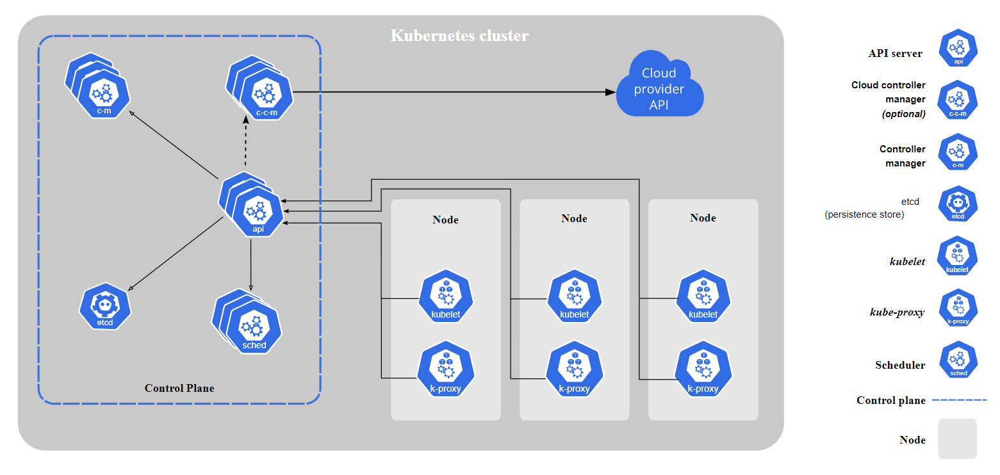

## Kubernetes Components

The term 'cluster' is often used to refer to the set of worker machines, called nodes, that run containerized applications. 
Every cluster has at least one worker node. 

NOTE: Having multiple master nodes ensures that services remain available should master node(s) fail. In order to facilitate availability of master services, they should be deployed with odd numbers (e.g. 3,5,7,9 etc.) so quorum (master node majority) can be maintained should one or more masters fail. If you have an even number of master nodes, it is possible to end up in a situation where the network breaks and you have 50% on both sides. In such a situation, you can't tell which side is having the most accurate/latest data.  

The architecture can be divided into two major components (See figure below - taken from kubernetes.io): 
1. Control Plane
2. Node

  

### Control Plane  
The control plane's components make global decisions about the cluster. These components can be run on any machine in the cluster, but for simplicity, all control plane components are started on the same machine, and do not run user containers on this machine.

1. kube-apiserver  
    The main implementation of a Kubernetes API server is kube-apiserver. The API server is a component of the Kubernetes control plane that exposes the Kubernetes API. The API server is the front end for the Kubernetes control plane.
2. etcd  
    This is a distributed key-value store used by Kubernetes to store all its data – its configuration data, its state, and its metadata. It is meant to provide storage with best of class stability, reliability, scalability and performance.
3. kube-scheduler  
    As the name suggests, this component is responsible for scheduling newly created pods to nodes that are available.
4. kube-controller-manager  
    This component is responsible for running the 'controller processes', which are a multiple processes compiled into a single binary (to reduce complexity). Some of the controllers are:  
    1. Node controller: Responsible for noticing and responding when nodes go down.
    2. Job controller: Watches for Job objects that represent one-off tasks, then creates Pods to run those tasks to completion.
    3. Endpoints controller: Populates the Endpoints object (that is, joins Services & Pods).
    4. Service Account & Token controllers: Create default accounts and API access tokens for new namespaces. 
5. cloud-controller-manager  
    The cloud controller manager lets you link your cluster into your cloud provider's API, and separates out the components that interact with that cloud platform from components that only interact with your cluster. The cloud-controller-manager only runs controllers that are specific to your cloud provider.  

    NOTE: If you are running Kubernetes on your own premises or locally, the cluster does not have a cloud controller manager.

### Node  
These components are run on every node.

1. kubelet  
    Kubelet is basically an agent that runs on each node in the cluster. It takes a set of PodSpecs that are provided through various mechanisms and ensures that the containers described in those PodSpecs are running and healthy.
2. kube-proxy  
    This is a network proxy that maintains network rules on nodes. These rules allow communication to your pods from inside/outside the cluster. 
3. Container Runtime  
    This is a software responsible for running containers. Kubernetes supports container runtimes such as containerd, CRI-O, etc.