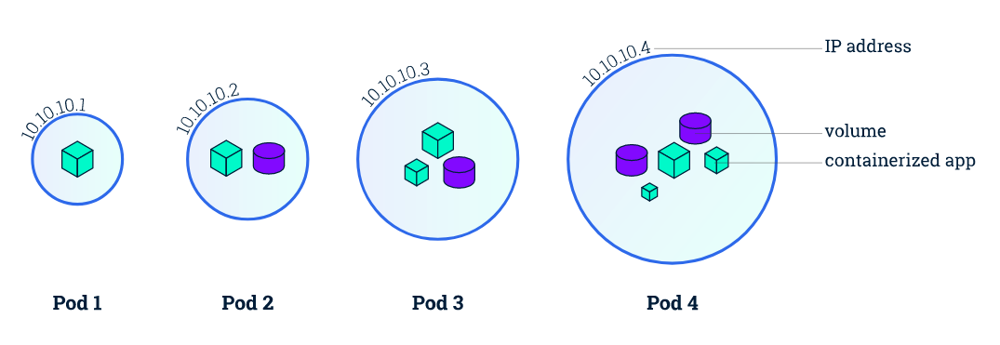

## Kubernetes Objects  

Kubernetes Objects are persistent entities in the cluster. These objects are used to represent the state of the cluster.  

Some of the Kubernetes Objects:
1. Pods
2. Namespaces
3. ReplicationController (Manages Pods)
4. DeploymentController (Manages Pods)
5. StatefulSets
6. DaemonSets
7. Services
8. ConfigMaps
9. Volumes

### Pods  

  

Every microservice is deployed as a single container.  
A 'Pod' represents a single instance of a running process in your cluster.  

So what's the relation between these two?  
Pods can contain one or more containers. When a Pod runs multiple containers, the containers are managed as a single entity and share the Pod's resources. A Pod is meant to run a single instance of your application on your cluster. When a pod contains multiple containers, all the containers run on one node, they can not be distibuted across worker nodes.  

An example of a multi-container pod can be:  
One container is responsible for the front-end of a website, while another is responsible for collecting logs and sending it to a server.  

NOTE: One thing to keep in mind is that the IP address is allocated to each pod, not for each container in the pod.

### Namespaces 

Namespaces provides a mechanism for isolating groups of resources within a single cluster. Names of resources need to be unique within a namespace, but not across namespaces; which means, a combination of an object name and a namespace, each object gets an unique identity across the cluster.

By default, a Kubernetes cluster is created with the following three namespaces:
1. default: By default all the resource created in Kubernetes cluster are created in the default namespace.
2. kube-public: Namespace for resources that are publicly readable by all users. This namespace is generally reserved for cluster usage.
3. kube-system: It is the Namespace for objects created by Kubernetes systems/control plane.  

Namespaces are intended for use in environments with many users spread across multiple teams, or projects.

### Replication Controller  

A ReplicationController ensures that a specified number of pod replicas are running at any one time.

If there are too many pods, the ReplicationController terminates the extra pods. If there are too few, the ReplicationController starts more pods. Unlike manually created pods, the pods maintained by a ReplicationController are automatically replaced if they fail, are deleted, or are terminated. 

### Deployment Controller

The Deployment controller and Job controller are examples of controllers that come as part of Kubernetes itself ("built-in" controllers).

You describe a desired state in a Deployment, and the Deployment Controller changes the actual state to the desired state at a controlled rate. 

### Stateful Sets

StatefulSet is a Kubernetes resource used to manage stateful applications. It manages the deployment and scaling of a set of Pods, and provides guarantee about the ordering and uniqueness of these Pods.

### Daemon Sets

A DaemonSet is a controller that ensures that the pod runs on all the nodes of the cluster. If a node is added/removed from a cluster, DaemonSet automatically adds/deletes the pod. A typical use case for this is monitoring/logging pods that need to run on all the nodes. 
