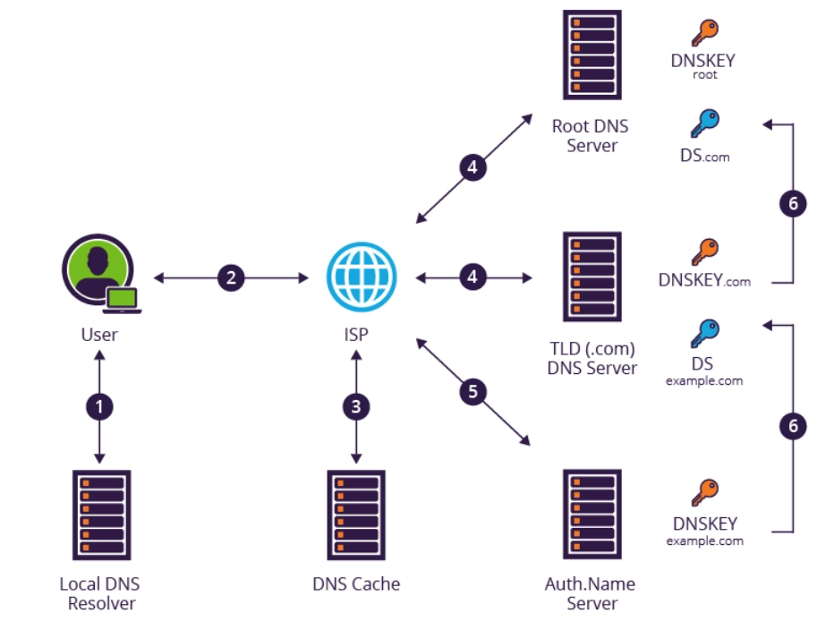

# DNSSEC

DNSSEC adds a layer of trust on top of DNS by providing authentication. It attempts to verify the authenticity of responses sent by name servers to clients, using digital signature technology. DNSSEC adds cryptographic signatures to DNS records, the DNS resolver then checks the signature associated with a record to verify its authenticity, before serving responses to clients. All records must match those stored on an authoritative DNS server.

To facilitate digital signature validation, DNSSEC defines several new DNS resource record types.

- Resource Record Signature (RRSIG) - An RRSIG record contains the cryptographic signature for a given record set.

- DNSKEY - A DNSKEY record holds a public key used in the DNS authentication process. When a security-aware DNS resolver receives a DNSSEC response, it retrieves the public key, and uses it to verify the signatures of the rest of the records. An authoritative name server provides a public key, whose matching private key was used to sign those records.

- DS - DNS delegation is the process of dividing up the DNS namespace into one or more zones. A delegation signer (DS) record is a hashed “fingerprint” of the public DNSKEY, stored in the parent zone. When a resolver tries to access records from a child zone, it verifies the public DNSKEY stored in the child zone. To do this, it hashes the DNSKEY and compares the hashed results with the DS record stored in the parent zone. If there is a match, the resolver can trust all records in the child zone.

- NSEC - A next secure record (NSEC) returns the next valid record name according to DNSSEC sorting order, allowing a DNS resolver to prove that a DNS record does not exist. Without NSEC records, the DNS server returns an empty answer for non-existent records, so it is not possible to verify if the record exists. A potential problem with NSEC records is NSEC-walking, which allows hackers to discover the entire contents of a zone by “walking” through all the NSEC records.

- NSEC3 - NSEC3 overcomes the potential for NSEC-walking by cryptographically hashing all record names in a zone.

- NSEC3 Parameter (NSEC3PARAM) - This record type contains the required parameters for a DNS server to determine which NSEC3-records to include in responses to DNSSEC requests for non-existent names.

## DNSSEC validation process

The DNSSEC validation process includes the following stages:

  

- A user types a URL address (e.g., example.com) into their browser. In order to discover the IP address for the hostname, the browser queries the local computer’s DNS resolver. A resolver is a software component responsible for locating and returning the correct IP address for a domain.
- If the local DNS resolver has the IP address in its cache, it returns it to the browser. If not, it passes the request to a recursive resolver managed by the Internet Service Provider (ISP).
- If the recursive resolver has the IP address in its cache, it returns it. Otherwise, it begins a recursive query to identify the DNS server that holds the authoritative information for the requested domain.
- The recursive resolver starts by contacting the root DNS server, and is referred to the top-level domain (TLD) DNS server for the domain. (e.g., for example.com, the global DNS server for all .com domains).
- The TLD DNS server refers the resolver to an authoritative name server – a DNS server that holds DNS records for the requested domain.
- At every stage, the resolver requests a DNSSEC key associated with the DNS zone, to verify that the server is authentic. Here too, the authoritative DNS server requests a DNSSEC key for the DNS zone “example.com”. The authoritative DNS server returns a DNS response with RRSIG records included.
- The recursive resolver validates the RRSIG, verifying that the address record was really sent by the authoritative name server and was not altered in transit. It then sends the validated DNS response with the IP address to the DNS client.

Because of the chain of trust and signed certificates, the protocol gives assurance on the next level of IP address or DNS response.