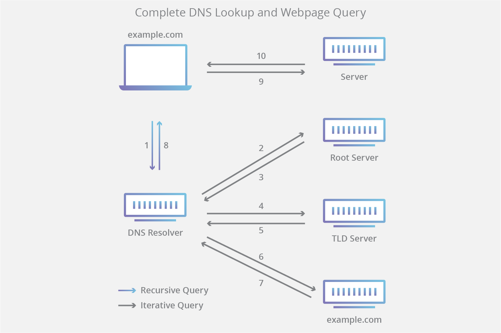

# Domain Name System (DNS)

The Domain Name System (DNS) is the phonebook of the Internet. Humans access information online through domain names, like nytimes.com or espn.com. Web browsers interact through Internet Protocol (IP) addresses. DNS translates domain names to IP addresses so browsers can load Internet resources.

Each device connected to the Internet has a unique IP address which other machines use to find the device - like a street address is used to find a particular home. DNS servers eliminate the need for humans to memorize IP addresses such as 192.168.1.1 (in IPv4), or more complex newer alphanumeric IP addresses such as 2400:cb00:2048:1::c629:d7a2 (in IPv6).

## How does DNS work?

The process of DNS resolution involves converting a hostname (such as www.example.com) into a computer-friendly IP address (such as 192.168.1.1). When a user wants to load a webpage, a translation must occur between what a user types into their web browser (example.com) and the machine-friendly address necessary to locate the example.com webpage.

For the web browser, the DNS lookup occurs "behind the scenes" and requires no interaction from the user’s computer apart from the initial request.

There are 4 DNS servers involved in loading a webpage:

1. DNS recursor - The recursor can be thought of as a librarian who is asked to go find a particular book somewhere in a library. The DNS recursor is a server designed to receive queries from client machines through applications such as web browsers. Typically the recursor is then responsible for making additional requests in order to satisfy the client’s DNS query.
   
2. Root nameserver - The root server is the first step in translating (resolving) human readable host names into IP addresses. It can be thought of like an index in a library that points to different racks of books - typically it serves as a reference to other more specific locations.

3. TLD nameserver - The top level domain server (TLD) can be thought of as a specific rack of books in a library. This nameserver is the next step in the search for a specific IP address, and it hosts the last portion of a hostname (In example.com, the TLD server is “com”).

4. Authoritative nameserver - This final nameserver can be thought of as a dictionary on a rack of books, in which a specific name can be translated into its definition. The authoritative nameserver is the last stop in the nameserver query. If the authoritative name server has access to the requested record, it will return the IP address for the requested hostname back to the DNS Recursor (the librarian) that made the initial request.

## What are the steps in a DNS lookup?

It is important to note that often DNS lookup information will be cached either locally inside the querying computer or remotely in the DNS infrastructure. There are typically 8 steps in a DNS lookup. When DNS information is cached, steps are skipped from the DNS lookup process which makes it quicker. The example below outlines all 8 steps when nothing is cached.

1. A user types ‘example.com’ into a web browser and the query travels into the Internet and is received by a DNS recursive resolver.
2. The resolver then queries a DNS root nameserver (.).
3. The root server then responds to the resolver with the address of a Top Level Domain (TLD) DNS server (such as .com or .net), which stores the information for its domains. When searching for example.com, our request is pointed toward the .com TLD.
4. The resolver then makes a request to the .com TLD.
5. The TLD server then responds with the IP address of the domain’s nameserver, example.com.
6. Lastly, the recursive resolver sends a query to the domain’s nameserver.
7. The IP address for example.com is then returned to the resolver from the nameserver.
8. The DNS resolver then responds to the web browser with the IP address of the domain requested initially.

Once the 8 steps of the DNS lookup have returned the IP address for example.com, the browser is able to make the request for the web page:

9. The browser makes a HTTP request to the IP address.
10. The server at that IP returns the webpage to be rendered in the browser (step 10).

  

## What is a DNS resolver?

The DNS resolver is the first stop in the DNS lookup, and it is responsible for dealing with the client that made the initial request. The resolver starts the sequence of queries that ultimately leads to a URL being translated into the necessary IP address.

Note: A typical uncached DNS lookup will involve both recursive and iterative queries.

It's important to differentiate between a recursive DNS query and a recursive DNS resolver. The query refers to the request made to a DNS resolver requiring the resolution of the query. A DNS recursive resolver is the computer that accepts a recursive query and processes the response by making the necessary requests.

## Types of DNS queries

In a typical DNS lookup three types of queries occur. By using a combination of these queries, an optimized process for DNS resolution can result in a reduction of distance traveled. In an ideal situation cached record data will be available, allowing a DNS name server to return a non-recursive query.

1. Recursive query - In a recursive query, a DNS client requires that a DNS server (typically a DNS recursive resolver) will respond to the client with either the requested resource record or an error message if the resolver can't find the record.

2. Iterative query - in this situation the DNS client will allow a DNS server to return the best answer it can. If the queried DNS server does not have a match for the query name, it will return a referral to a DNS server authoritative for a lower level of the domain namespace. The DNS client will then make a query to the referral address. This process continues with additional DNS servers down the query chain until either an error or timeout occurs.

3. Non-recursive query - typically this will occur when a DNS resolver client queries a DNS server for a record that it has access to either because it's authoritative for the record or the record exists inside of its cache. Typically, a DNS server will cache DNS records to prevent additional bandwidth consumption and load on upstream servers.

## What is DNS caching? Where does DNS caching occur?

The purpose of caching is to temporarily store data in a location that results in improvements in performance and reliability for data requests. DNS caching involves storing data closer to the requesting client so that the DNS query can be resolved earlier and additional queries further down the DNS lookup chain can be avoided, thereby improving load times and reducing bandwidth/CPU consumption. DNS data can be cached in a variety of locations, each of which will store DNS records for a set amount of time determined by a time-to-live (TTL).

#### **Browser DNS caching**
Modern web browsers are designed by default to cache DNS records for a set amount of time. The purpose here is obvious; the closer the DNS caching occurs to the web browser, the fewer processing steps must be taken in order to check the cache and make the correct requests to an IP address. When a request is made for a DNS record, the browser cache is the first location checked for the requested record.

In Chrome, you can see the status of your DNS cache by going to chrome://net-internals/#dns.

#### **Operating system (OS) level DNS caching**
The operating system level DNS resolver is the second and last local stop before a DNS query leaves your machine. The process inside your operating system that is designed to handle this query is commonly called a “stub resolver” or DNS client. When a stub resolver gets a request from an application, it first checks its own cache to see if it has the record. If it does not, it then sends a DNS query (with a recursive flag set), outside the local network to a DNS recursive resolver inside the Internet service provider (ISP).

When the recursive resolver inside the ISP receives a DNS query, like all previous steps, it will also check to see if the requested host-to-IP-address translation is already stored inside its local persistence layer.

The recursive resolver also has additional functionality depending on the types of records it has in its cache:

1. If the resolver does not have the A records, but does have the NS records for the authoritative nameservers, it will query those name servers directly, bypassing several steps in the DNS query. This shortcut prevents lookups from the root and .com nameservers (in our search for example.com) and helps the resolution of the DNS query occur more quickly.
2. If the resolver does not have the NS records, it will send a query to the TLD servers (.com in our case), skipping the root server.
3. In the unlikely event that the resolver does not have records pointing to the TLD servers, it will then query the root servers. This event typically occurs after a DNS cache has been purged.

## DNS Records

DNS servers create a DNS record to provide important information about a domain or hostname, particularly its current IP address. The most common DNS record types are:

1. Address Mapping record (A Record) - also known as a DNS host record, stores a hostname and its corresponding IPv4 address.
2. IP Version 6 Address record (AAAA Record) - stores a hostname and its corresponding IPv6 address.
3. Canonical Name record (CNAME Record) - can be used to alias a hostname to another hostname. When a DNS client requests a record that contains a CNAME, which points to another hostname, the DNS resolution process is repeated with the new hostname.
4. Mail exchanger record (MX Record) - specifies an SMTP email server for the domain, used to route outgoing emails to an email server.
5. Name Server records (NS Record) - specifies that a DNS Zone, such as “example.com” is delegated to a specific Authoritative Name Server, and provides the address of the name server.
6. Reverse-lookup Pointer records (PTR Record) - allows a DNS resolver to provide an IP address and receive a hostname (reverse DNS lookup).
7. Certificate record (CERT Record) - stores encryption certificates such as PKIX, SPKI, PGP, and so on.
8. Service Location (SRV Record) - a service location record, like MX but for other communication protocols.
9. Text Record (TXT Record) - typically carries machine-readable data such as opportunistic encryption, sender policy framework, DKIM, DMARC, etc.
10. Start of Authority (SOA Record) - this record appears at the beginning of a DNS zone file, and indicates the Authoritative Name Server for the current DNS zone, contact details for the domain administrator, domain serial number, and information on how frequently DNS information for this zone should be refreshed.