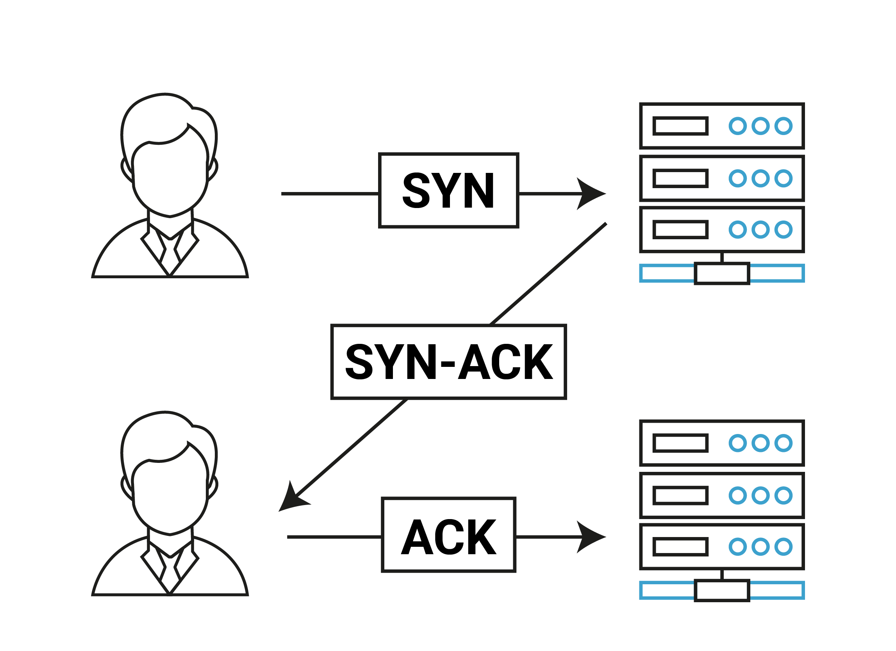

### What is a three-way handshake?

A three-way handshake (also known as TCP handshake or SYN-SYN-ACK) is a method used in a TCP/IP network to create a connection between a local host/client and server.
In fact, its name originates from the three messages transmitted by TCP before a session between the two ends is initiated.

  

Steps -
1. The client node sends a SYN (Synchronize Sequence Number) data packet over an IP network to a server on the same or an external network. The objective of this packet is to ask/infer if the server is open for new connections.
2. When the server receives the SYN packet from the client node, it responds and returns a confirmation receipt – the ACK (Acknowledgement Sequence Number) packet or SYN/ACK packet.  
  This packet includes two sequence numbers.  
    1. The first one is ACK one, which is set by the server to one more than the sequence number it received from the client.  
    2. The second one is the SYN sent by the server, which is another random sequence number
3. Now it’s the turn of the client to acknowledge the server’s packet by adding one to the sequence number (in this case, Y+1), and resend it to the server.

<ins>Advantage -</ins>
Since both hosts must acknowledge the connection parameters of the other side, a missing or out-of-order segment can be quickly detected before the actual data transfer process is initiated.

