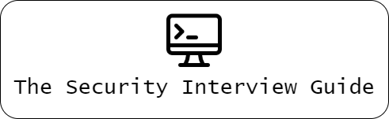

<!-- ALL-CONTRIBUTORS-BADGE:START - Do not remove or modify this section -->

<!-- ALL-CONTRIBUTORS-BADGE:END -->
  

The aim of this repository is to help students prepare for jobs in the Security Domain by consolidating useful resources and summarizing the most important concepts asked in interviews. 

## Contributing

Pull Requests of any kind are welcome. If you feel like somethings missing in this guide, feel free to send a PR to the repository and see your name appear on the contributors list! (TODO)
## Contributors ✨

Thanks goes to these wonderful people ([emoji key](https://allcontributors.org/docs/en/emoji-key)):

<!-- ALL-CONTRIBUTORS-LIST:START - Do not remove or modify this section -->
<!-- prettier-ignore-start -->
<!-- markdownlint-disable -->
<table>
  <tr>
    <td align="center"><a href="https://github.com/keertanakamesh"> <b>Keertana Kamesh</b></a> <a href="#content-keertanakamesh" title="Content">🖋</a> <a href="https://github.com/AyushAmbastha/The-Security-Interview-Guide/commits?author=keertanakamesh" title="Code">💻</a> <a href="https://github.com/AyushAmbastha/The-Security-Interview-Guide/commits?author=keertanakamesh" title="Documentation">📖</a></td>
  </tr>
</table>

<!-- markdownlint-restore -->
<!-- prettier-ignore-end -->

<!-- ALL-CONTRIBUTORS-LIST:END -->

This project follows the [all-contributors](https://github.com/all-contributors/all-contributors) specification. Contributions of any kind welcome!